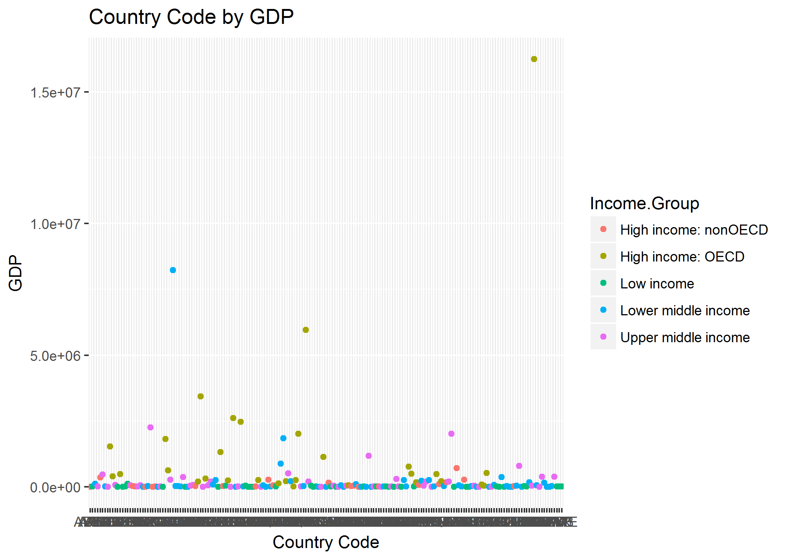

<b>Introduction</b> <br>
<p>
Gross domestic product (GDP) is the monetary value of all the finished goods and services produced within a country's borders in a specific period. GDP is a broad measurement of a nation's overall economic activity. GDP data when combined with the other comparable indicators of the countries like education access, progression, completion, literacy, teachers, population, and expenditures could help in understanding how GDP is related these other factors of the various economies in the world. This kind of analysis could lead to study of GDP in a very broader aspect like how the GDP of economies very for countries with high population then countries with low population. In this study, we will view and analyze GDP with respect to the income groups of the various economies.
</p>
<br> <br>

``` r
# Load the GDP data into the data frame named cleaned_GDP_Data
cleaned_GDP_Data <- read.csv("data/cleaned_GDP_Data.txt",header=T, sep="\t")

# Load the Education data into the data frame named cleaned_EDU_Data
cleaned_EDU_Data <- read.csv("data/cleaned_EDU_Data.txt",header=T, sep="\t")

# Load dplyr package
library(dplyr)
```

    ## 
    ## Attaching package: 'dplyr'

    ## The following objects are masked from 'package:stats':
    ## 
    ##     filter, lag

    ## The following objects are masked from 'package:base':
    ## 
    ##     intersect, setdiff, setequal, union

<b>Question 1: 1 Merge the data based on the country shortcode. How many IDs matched?</b>

``` r
# Merge the GDP and EDU data by Country Code
merged_Data <- merge(cleaned_GDP_Data, cleaned_EDU_Data, by.x = "Country.Code", by.y = "CountryCode")

# Write the data frame into the data folder with file name as merged_Data.txt
write.table(merged_Data, "data/merged_Data.txt", sep = "\t", row.names = FALSE, quote = FALSE)

# Country codes in GDP data which were not matched
select(cleaned_GDP_Data[!cleaned_GDP_Data$Country.Code %in% merged_Data$Country.Code,],Country.Code)
```

    ##     Country.Code
    ## 131          SSD

``` r
# Country codes in Education data which were not matched
select(cleaned_EDU_Data[!cleaned_EDU_Data$CountryCode %in% merged_Data$Country.Code,],CountryCode)
```

    ##     CountryCode
    ## 2           ADO
    ## 9           ASM
    ## 35          CHI
    ## 46          CYM
    ## 50          DJI
    ## 64          FRO
    ## 76          GRL
    ## 78          GUM
    ## 86          IMY
    ## 109         LBY
    ## 111         LIE
    ## 128         MMR
    ## 131         MNP
    ## 138         NCL
    ## 155         PRK
    ## 158         PYF
    ## 170         SMR
    ## 171         SOM
    ## 181         TCA
    ## 201         VIR
    ## 204         WBG

There are 190 countries in the GDP files and 210 countries in the Education file. When these files are merged together in the basis of the country code, there are 189 countries matched. Country code SSD in the GDP file is not found in the Education file. Countries corresponding to the country codes ADO, ASM, CHI, CYM, DJI, FRO, GRL, GUM, IMY, LBY, LIE, MMR, MNP, NCL, PRK, PYF, SMR, SOM, TCA, VIR and WBG are missing in the GDP file but are present in the Education file. <br>

<b>Question 2: Sort the data frame in ascending order by GDP (so United States is last). What is the 13th country in the resulting data frame?</b>

``` r
# The following R code sorts the Merged Data file in increasing order of GDP
# sort_by_GDP <- merged_Data[order(merged_Data$GDP.in.Millions.USD),]
sort_by_GDP <- arrange(merged_Data,GDP.in.Millions.USD)

#Verify the last country in the sorted data frame is United States
tail(sort_by_GDP$Country, n=1)
```

    ## [1] United States
    ## 190 Levels: Afghanistan Albania Algeria Angola ... Zimbabwe

``` r
# Find the 13th country in the sorted data set. 
sort_by_GDP[13,c("Country.Code","Country","GDP.in.Millions.USD","GDP.Ranking", "Income.Group")]
```

    ##    Country.Code             Country GDP.in.Millions.USD GDP.Ranking
    ## 13          KNA St. Kitts and Nevis                 767         178
    ##           Income.Group
    ## 13 Upper middle income

"St. Kitts and Nevis" is the 13 country in ascending order of GDP of the 189 countries in the merged data. Its country code is KNA, GDP Rank is 178, GDP is 767 Million USD and belongs to Upper middle group. <br>

<b>Question 3: What are the average GDP rankings for the "High income: OECD" and "High income: nonOECD" groups</b>

``` r
# The following R code calculates the average GDP rankings for the "High income: OECD" 
#  and "High income: nonOECD" groups
merged_Data %>% 
  # filter records to have rows with "High income: OECD" and "High income: nonOECD" income group
  filter(Income.Group=='High income: nonOECD' | Income.Group=='High income: OECD') %>% 
  # Group the data by income group 
  group_by(Income.Group) %>% 
  # Compute the mean of GDP Ranking
  summarize(mean(GDP.Ranking)) %>%
  # Convert the result into a Data Frame to make it more readable
  as.data.frame %>%
  # Assign proper column headings
  setNames(c("Income.Group", "Mean.GDP.Ranking"))
```

    ##           Income.Group Mean.GDP.Ranking
    ## 1 High income: nonOECD         91.91304
    ## 2    High income: OECD         32.96667

The mean GDP ranking of the countries in - High income: nonOECD income group is 91.91304 - High income: OECD income group is 32.96667 <br>

<b>Question 4: Plot the GDP for all of the countries. Use ggplot2 to color your plot by Income Group.</b>

``` r
# plot GDP
library(ggplot2)
plot1 <- qplot(Country.Code, GDP.in.Millions.USD, data=merged_Data, color=Income.Group, geom = 
    "point", xlab="Country Code", ylab="GDP", main="Country Code by GDP")
# Save the plot
ggsave(filename = "graphs/CountryCode_vs_GDP.png", device="png", plot=plot1)
```

    ## Saving 7 x 5 in image

``` r
# Display the plot in the markdown file
```



``` r
# Since most of the GDP values are very small (almost 0) compared to GDP of USA, it is difficult 
# to draw any meaningful inferences from the graph. So, based on the income group, split the graph 
# to make it readable and draw some inferences out from it.
# The below code plots the GDP of the countries splitting the graph vertically such that data
# corresponding to countries in different income group appear in different splitted section.
plot2 <- ggplot(merged_Data, aes(x=Country.Code,y=GDP.in.Millions.USD, colour=Income.Group,
    group=Income.Group )) + geom_point() + geom_line() + theme(strip.background = element_blank(),
    strip.text.x = element_blank(), legend.position="top", legend.text=element_text(size=6), 
    axis.text.x = element_text(angle = 90, hjust = 0, size=4, vjust=0)) + facet_grid(. ~ Income.Group, 
    drop = F,  scales = "free", space ="free") + xlab("Country Code") + ylab("GDP (Millions USD)") +
    ggtitle("Country Code by GDP")
# Save the plot
ggsave(filename = "graphs/Modified CountryCode_vs_GDP.png", device="png", plot=plot2)
```

    ## Saving 7 x 5 in image

``` r
# Display the plot in the markdown file
```

 <br>

<b>Question 5: Cut the GDP ranking into 5 separate quantile groups. Make a table versus Income.Group. How many countries are Lower middle income but among the 38 nations with highest GDP?</b>

``` r
# cut the GDP ranking into 5 separate quantile groups
ApplyQuantiles <- cut(merged_Data$GDP.Ranking, breaks=5)

# create a table with Income Group vs GDP Ranking Quantiles 
Income_vs_GDP_rank_quantiles <- table(merged_Data$Income.Group, ApplyQuantiles)

# View the table created
Income_vs_GDP_rank_quantiles
```

    ##                       ApplyQuantiles
    ##                        (0.811,38.8] (38.8,76.6] (76.6,114] (114,152]
    ##   High income: nonOECD            4           5          8         4
    ##   High income: OECD              18          10          1         1
    ##   Low income                      0           1          9        16
    ##   Lower middle income             5          13         12         8
    ##   Upper middle income            11           9          8         8
    ##                       ApplyQuantiles
    ##                        (152,190]
    ##   High income: nonOECD         2
    ##   High income: OECD            0
    ##   Low income                  11
    ##   Lower middle income         16
    ##   Upper middle income          9

``` r
# Assign proper column heading to the table
colnames(Income_vs_GDP_rank_quantiles) <- c("1-38","39-76","77-114", "115-152", "153-190")

# Number of countries in lower middle income that are among the 38 nations in the highest quantile group
Income_vs_GDP_rank_quantiles["Lower middle income","1-38"]
```

    ## [1] 5

There are 5 countries that belong to the Lower middle income group but are amongst the top 38 countries with high GDP values. <br>

<b>Conclusion</b> <br>
<p>
In this study, we have tried to examine the relationship between the income group of a country on its GDP value. The study incorporates visual tools to examine this relationship.

The conclusion drawn from the visual inspection of the data is as below: - For countries with low income, the GDP is very low and is almost the same for all those countries. Countries in lower middle income group follow the same trend as countries in low income group i.e. they have low GDP and GDP is almost the same for all these countries. There are a few exceptions here where the countries though in the lower middle income group have high GDP. For countries in High Income: nonOECD group, the GDP amount variation is very less and the GDP amount is low as well. For countries in upper middle income group, there is visible variation in GDP. Overall it appears that average GDP for countries in upper middle income group is higher then countries in Low income, High Income: nonOECD and Lower middle income (after removing the outlier China from lower middle income group). In the High income: OCED grouped countries, the variation in GDP is high. But still there are countries in this group which are having low GDP values. Considering the above-mentioned points, it can be said that there is no cause effect relationship between the Income Group of the country and its GDP. There might be association between the two but statically, analysis of the data does not evidence in favour of the association.

The presence of 5 countries of the lower middle income group in top 38 nations with respect to GDP and country "St. Kitts and Nevis" belonging to Upper middle income as the 13th nation when countries are arranged in ascending order of GDP supports the above conclusions drawn regarding the relationship between Income Group of the country and its GDP.
</p>
